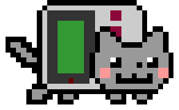

 

    

👋 Welcome to my GitHub! I'm Charlie Meyer, a full-time student at UVA who also loves designing things - websites, readme's, and much more. My repositories are just getting started, and I hope my page expands to something great as my coding experience develops. Check out my website <a href="https://charliemeyer.xyz" target="_blank" rel="noopener noreferrer" style="color: #FFD700;">charliemeyer.xyz</a> and email <a href="mailto:charlie@charliemeyer.xyz" style="color: #FFD700; " target="_blank" rel="noopener noreferrer">charlie@charliemeyer.xyz</a>  for any inquiries.

    

        
        <h1 style="display: inline-block; color: #FF6347; border-bottom: none" >Projects</h1>
    

    

        <ul>
            <li><a href="https://github.com/charliemeyer2000/website" target="_blank" rel="noopener noreferrer" style="color: #FFD700">My personal website</li>
            <li><a href="https://github.com/charliemeyer2000/TwitterToLCD" target="_blank" rel="noopener noreferrer" style="color: #FFD700;">TwitterToLCD</li>
            <li><a href="https://github.com/charliemeyer2000/SpotipyJoystick" target="_blank" rel="noopener noreferrer" style="color: #FFD700;">SpotipyJoystick </a></li>
            <li><a href="https://github.com/IROATUVA" target="_blank" rel="noopener noreferrer" style="color: #FFD700;">IRO Treasurer Site</a></li>
        </ul>
    

    

        
        <h1 style="display: inline-block; color: #FF6347; border-bottom: none; padding-left: 0.2em" >GitHub Stats and Activity </h1>
    

     
    

<!--
**charliemeyer2000/charliemeyer2000** is a ✨ _special_ ✨ repository because its `README.md` (this file) appears on your GitHub profile.

Here are some ideas to get you started:

- 🔭 I’m currently working on ...
- 🌱 I’m currently learning ...
- 👯 I’m looking to collaborate on ...
- 🤔 I’m looking for help with ...
- 💬 Ask me about ...
- 📫 How to reach me: ...
- 😄 Pronouns: ...
- ⚡ Fun fact: ...
-->
